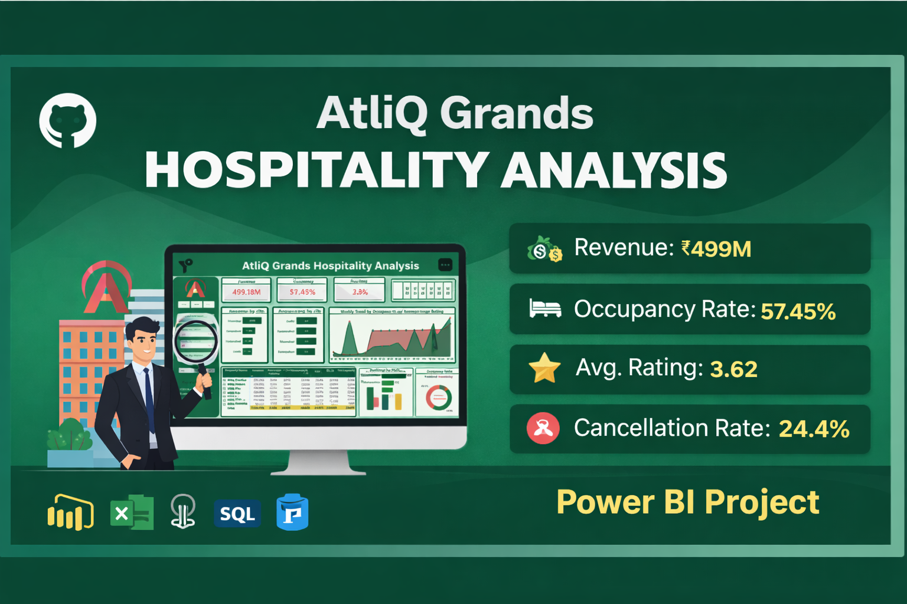

# 🏨 AtliQ Grands Hospitality Analysis

------------------------------------------------------------------------

## 📌 Project Overview

A **Power BI Business Intelligence Dashboard** analyzing hotel
performance across India.\
This project focuses on uncovering insights related to **Revenue,
Occupancy, Ratings, and Booking Behavior**.

------------------------------------------------------------------------

## 🎯 Problem Statement

AtliQ Grands is facing: - 📉 Declining revenue & market share\
- ❌ High cancellation rates\
- 📊 Lack of data-driven decisions

------------------------------------------------------------------------

## 🖼️ Dashboard Preview

### 🔹 Overall Analysis

### 🔹 Monthly & Platform Analysis

### 🔹 Data Model

------------------------------------------------------------------------

## 📊 Key Insights

-   💰 Revenue: **499M+**
-   🏨 Occupancy: **57%**
-   ⭐ Avg Rating: **3.62**
-   ❌ Cancellation Rate: **24%**

✔ Mumbai generates highest revenue\
✔ Delhi leads in customer satisfaction\
✔ High cancellations reduce profitability\
✔ Significant gap between capacity & bookings

------------------------------------------------------------------------

## 🧩 Data Model

**Star Schema Design** - Fact Tables: `fact_bookings`,
`fact_aggregated_bookings` - Dimension Tables: `dim_date`, `dim_hotels`,
`dim_rooms`

------------------------------------------------------------------------

## 🛠️ Tools & Technologies

-   Power BI\
-   Power Query\
-   DAX\
-   Excel

------------------------------------------------------------------------

## 🚀 Business Impact

-   Identified revenue leakage due to cancellations\
-   Highlighted underutilized hotel capacity\
-   Enabled better pricing & demand strategies

------------------------------------------------------------------------

## 📈 Skills Demonstrated

-   Data Modeling\
-   DAX Calculations\
-   Dashboard Design\
-   Business Analysis

------------------------------------------------------------------------

## 🙋‍♂️ About Me

Transitioning from **11+ years MIS Executive** to **Data Analyst**\
Skilled in **Excel, Power BI, SQL, Python**

------------------------------------------------------------------------

## ⭐ Support

If you like this project, please give it a ⭐ on GitHub!
